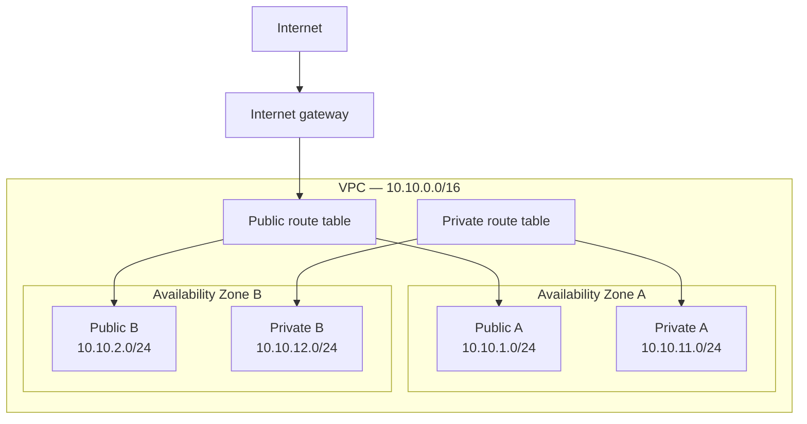

# AWS Network Design

**Status:** Planned  
**Primary region:** Africa (Cape Town) — `af-south-1`

## Overview

This document defines the network architecture for the AWS Cloud Security Lab before any networking resources are provisioned.

## Address plan

| Component | CIDR block |
|---|---|
| VPC | `10.10.0.0/16` |
| Public subnet A | `10.10.1.0/24` |
| Public subnet B | `10.10.2.0/24` |
| Private subnet A | `10.10.11.0/24` |
| Private subnet B | `10.10.12.0/24` |

## Architecture

## Routing design

The public subnets will use a route table containing a default route to the internet gateway.

The private subnets will use a separate route table without a default internet route. This prevents resources in those subnets from communicating directly with the public internet.

A NAT gateway will not be deployed initially because it incurs ongoing hourly and processing costs. Private outbound connectivity can be added later if the project develops a valid requirement for it.

## Planned workload access

A temporary EC2 test instance will initially be deployed in a public subnet. It will not expose SSH to the internet. Administrative access will use AWS Systems Manager Session Manager.

## Supporting services

The environment will later integrate with:

- Amazon S3
- AWS CloudTrail
- Amazon CloudWatch
- AWS Key Management Service
- AWS Identity and Access Management
- AWS Systems Manager

## Design reasoning
### Why was the Cape Town region selected?

Cape Town is geographically closest to the project owner, supports the required services, and provides an opportunity to consider latency and regional data residency.
It is an important habit to make sure you are creating and deleting resources in the right location. Resources created in one location may not show up in another. 

### Why does the design use two Availability Zones?

Using two Availability Zones creates the foundation for fault tolerance because each Availability Zone uses physically separate infrastructure. Workloads can later be deployed redundantly across both zones so that the failure of one zone does not make the entire application unavailable.
Creating subnets in two Availability Zones does not provide automatic failover by itself; the workloads and failover mechanisms must also be configured appropriately.

### What makes a subnet public?

A subnet is considered public when its route table contains a route to an internet gateway. A resource inside the subnet also requires a public IPv4 address or Elastic IP, along with appropriate security-group and network ACL rules, to communicate with the internet.

### Why are we initially avoiding a NAT gateway?

NAT gateways incur ongoing hourly and processing charges, so I am omitting it from this project to keep costs down
