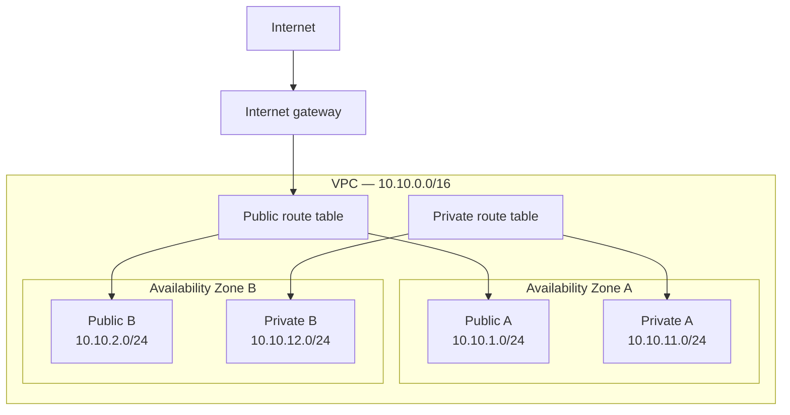

# AWS Network Design

**Status:** Planned  
**Primary region:** Africa (Cape Town) — `af-south-1`

## Overview

This document defines the network architecture for the AWS Cloud Security Lab before any networking resources are provisioned.

## Address plan

| Component | CIDR block |
|---|---|
| VPC | `10.10.0.0/16` |
| Public subnet A | `10.10.1.0/24` |
| Public subnet B | `10.10.2.0/24` |
| Private subnet A | `10.10.11.0/24` |
| Private subnet B | `10.10.12.0/24` |

## Architecture

## Design reasoning
### Why was the Cape Town region selected?

Cape Town is also geographically closest to the project owner, supports the required services, and provides an opportunity to consider latency and regional data residency.
It is an important habit to make sure you are creating and deleting resources in the right location. Resources created in one location may not show up in another. 

### Why does the design use two Availability Zones?

Using more than 1 zone gives the system more fault Fault Tolerance. Each zone has its own independent uninterruptible power supplies, backup generators, and cooling equipment.
Spreading your applications and databases across multiple AZs also ensures that if one zone goes down, your system keeps running using the other active zones.

### What makes a subnet public?

A subnet is public because its route table contains a route to an internet gateway.

### Why are we initially avoiding a NAT gateway?

NAT gateways incur ongoing hourly and processing charges, so I am omitting it from this project to keep costs down
