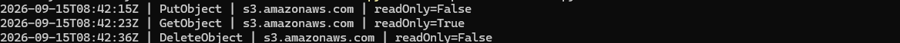

# AWS CloudTrail Audit Logging

## Objective

Create persistent audit logging for AWS account activity and validate that
management and selected S3 object-level events are captured.

## Trail configuration

The multi-Region trail `cloud-security-lab-trail` was configured with:

- Read and write management events
- Log-file validation
- A dedicated S3 audit-log bucket
- S3 data events scoped to one secure-data bucket
- Read and write S3 data events
- No organization-wide configuration
- No CloudTrail Insights events
- No network activity events

The exact audit-bucket name and AWS account identifiers are intentionally
excluded from this repository.

## Audit-log storage

CloudTrail logs are delivered to a dedicated S3 bucket separate from workload
data.

The audit bucket uses:

- S3 Block Public Access
- Bucket-owner-enforced Object Ownership
- Disabled ACLs
- SSE-S3 encryption
- S3 Versioning
- Audit-log classification tags
- A CloudTrail-generated delivery policy

The automatically generated bucket policy was preserved because it grants the
CloudTrail service the permissions required to validate the bucket and deliver
log objects.

## Management events and data events

Management events record control-plane activity such as creating resources,
modifying policies, and changing service configurations.

S3 object operations are data-plane activity and require data-event logging.

To limit unnecessary logging and cost, S3 data events were enabled only for
the secure-data bucket. The CloudTrail destination bucket was deliberately
excluded to avoid recursive or unnecessary object-event logging.

## Log-file validation

CloudTrail log-file validation was enabled. CloudTrail produces digest files
that can be used to determine whether delivered log files were modified or
deleted after delivery.

## Controlled validation

A test object was used to generate three S3 API operations:

1. Uploading the object generated `PutObject`.
2. Downloading the object generated `GetObject`.
3. Deleting the current object generated `DeleteObject`.

The delivered CloudTrail logs confirmed:

| Event | Event source | Read-only value |
|---|---|---:|
| `PutObject` | `s3.amazonaws.com` | `False` |
| `GetObject` | `s3.amazonaws.com` | `True` |
| `DeleteObject` | `s3.amazonaws.com` | `False` |

This correctly classifies downloading as a read operation and uploading or
deleting as write operations.

## Safe log inspection

Raw CloudTrail logs can contain:

- AWS account IDs
- IAM identities and session information
- Source IP addresses
- Resource ARNs
- Bucket and object names
- Request parameters

For this reason, raw log files were downloaded only to a temporary local
review folder and were not committed to GitHub.

A Python script was used to extract only the event timestamp, event name,
event source, and read-only classification:

[CloudTrail event summary script](../../scripts/cloudtrail_event_summary.py)

## Evidence

The evidence shows the three expected S3 data events without exposing account
IDs, identities, source IP addresses, bucket names, or resource ARNs.

## Troubleshooting

The first inspection script searched only for files ending in `.json.gz` and
reported no matching events.

A local file-extension check showed that the browser had already decompressed
the downloaded CloudTrail logs and saved them as `.json` files.

The script was updated to support both:

- Compressed `.json.gz` CloudTrail logs
- Browser-decompressed `.json` CloudTrail logs

After the correction, the expected `PutObject`, `GetObject`, and
`DeleteObject` events were found.

## Cost controls

The implementation limits cost by:

- Using one copy of management events
- Scoping paid S3 data events to one lab bucket
- Excluding the audit bucket from data-event logging
- Using SSE-S3 instead of a customer-managed KMS key
- Not sending logs to CloudWatch Logs during this stage
- Not enabling CloudTrail Insights

## Future improvements

Future stages can add:

- CloudWatch Logs integration
- Metric filters and security alarms
- A customer-managed KMS key
- Restrictive KMS and bucket policies
- Lifecycle rules for audit-log retention
- Athena queries for larger investigations
- Automated detections for suspicious API activity
