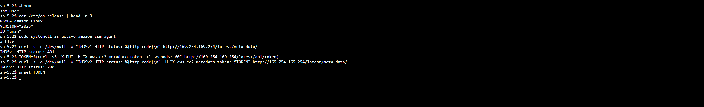

# Secure EC2 Administration

## Objective

Deploy and administer an Amazon EC2 instance without exposing SSH or another
inbound administrative service to the internet.

## Instance configuration

The temporary lab instance was configured with:

- Amazon Linux 2023
- A small `t3.micro` instance type
- An encrypted 8 GiB `gp3` EBS root volume
- EBS deletion enabled when the instance is terminated
- IMDSv2 required
- No SSH key pair
- A dedicated IAM instance role
- A dedicated security group
- AWS Systems Manager Session Manager for administration

## IAM authorization

The instance uses the IAM role:

`cloud-security-lab-ec2-ssm-role`

The role contains the AWS-managed `AmazonSSMManagedInstanceCore` policy. This
allows the SSM agent running on the instance to register with and communicate
with AWS Systems Manager.

No long-term access keys were stored on the instance.

## Network controls

The instance uses the security group:

`cloud-security-lab-ec2-sg`

The security group has:

- No inbound rules
- No SSH rule on TCP port 22
- Outbound HTTPS on TCP port 443 only

The security group is stateful, so response traffic for connections initiated
by the instance is allowed automatically.

For this stage, the instance was placed temporarily in a public subnet with a
public IPv4 address so that it could reach the public Systems Manager endpoints.
The absence of inbound security-group rules prevents internet-initiated access.

## Secure administrative access

The instance was accessed through AWS Systems Manager Session Manager.

Successful validation confirmed:

- The session used the automatically created `ssm-user`
- The operating system was Amazon Linux 2023
- The Amazon SSM agent was active
- No SSH key or inbound SSH access was required

## Instance metadata protection

The instance was configured to require Instance Metadata Service Version 2
(IMDSv2).

Validation produced the following results:

| Request | Result | Meaning |
|---|---:|---|
| Tokenless IMDSv1-style request | HTTP 401 | Access rejected |
| Token-authenticated IMDSv2 request | HTTP 200 | Access permitted |

The IMDSv2 token was stored only in a temporary shell variable and removed
after testing.

## Evidence

The screenshot shows successful Session Manager access, the active SSM agent,
and the IMDSv1 and IMDSv2 HTTP validation results. Identifying information and
credentials are not included.

## Cost control

After validation, the Session Manager session was closed and the EC2 instance
was stopped. This prevents continued instance compute and public IPv4 usage
while preserving the encrypted EBS volume for later stages.

## Future improvement

A future version can place the instance in a private subnet and use VPC
interface endpoints for Systems Manager. This would remove the need for a
public IPv4 address and allow more tightly restricted outbound connectivity.
