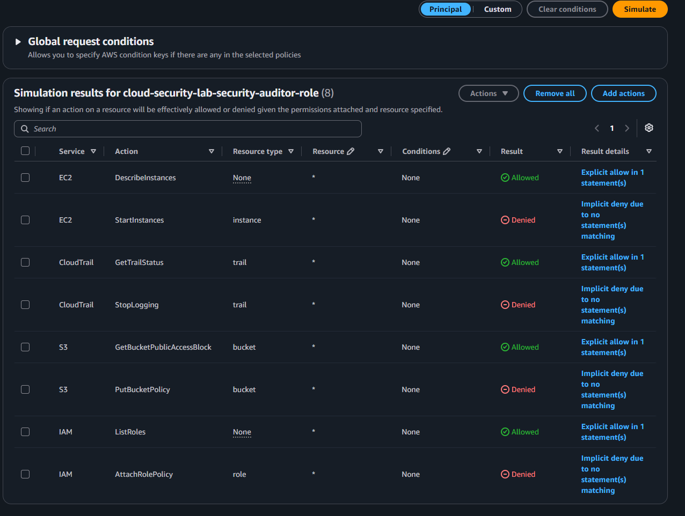

# IAM Security Auditor Role

## Objective

Create a temporary, MFA-protected role that can inspect AWS security
configuration without modifying cloud resources.

This introduces separation between administrative work and routine security
review.

## Role configuration

The role was created with:

- Role name: `cloud-security-lab-security-auditor-role`
- Trusted account: the same AWS account
- MFA required for role assumption
- AWS-managed `SecurityAudit` permissions policy
- No permissions boundary during this initial implementation
- Project, environment, purpose, and owner tags

The public trust-policy example uses an `ACCOUNT_ID` placeholder:

[MFA-protected auditor trust policy](../../policies/security-auditor-trust-policy.json)

## Trust policy and permissions policy

The role uses two different policy functions:

- The trust policy determines who can assume the role and requires MFA.
- The permissions policy determines what an assumed-role session can do.

Trusting the AWS account does not automatically grant every identity access.
An identity must also have permission to call `sts:AssumeRole`.

## Temporary role permissions

When the role is assumed, the original IAM user permissions are temporarily
replaced by the role permissions. They are not combined.

Exiting the role restores the original user session.

This allows the same authenticated person to work under different permission
sets depending on the task being performed.

## Policy simulation

The IAM Policy Simulator was used to test the role without performing real
changes.

| Service | Action | Expected | Actual |
|---|---|---:|---:|
| EC2 | `DescribeInstances` | Allowed | Allowed |
| EC2 | `StartInstances` | Denied | Denied |
| CloudTrail | `GetTrailStatus` | Allowed | Allowed |
| CloudTrail | `StopLogging` | Denied | Denied |
| S3 | `GetBucketPublicAccessBlock` | Allowed | Allowed |
| S3 | `PutBucketPolicy` | Denied | Denied |
| IAM | `ListRoles` | Allowed | Allowed |
| IAM | `AttachRolePolicy` | Denied | Denied |

## Implicit deny

The modifying actions were denied because no attached policy allowed them.
This is an implicit deny under AWS policy evaluation.

An implicit deny is different from an explicit deny. If another policy later
granted one of these actions, it could become allowed unless an applicable
explicit-deny control prevented it.

Permissions boundaries and stronger guardrails will be evaluated later in the
project.

## Console validation

The role was successfully assumed through the AWS Management Console using an
MFA-authenticated session.

While using the role, the following security configurations were visible:

- EC2 instances
- VPCs and security groups
- S3 bucket security settings
- CloudTrail trail status
- IAM roles and policies

The session was then switched back to the original administrator identity.

## Evidence

The screenshot demonstrates allowed security-inspection actions and denied
modifying actions without exposing AWS account or resource identifiers.

## Current limitation

`SecurityAudit` is an AWS-managed policy with broad read access to security
configuration across the account. It is significantly less privileged than
`AdministratorAccess`, but it is not scoped only to this project's resources.

The bootstrap administrator access remains temporarily available as a
recovery path while narrower permissions are designed and tested.

## Next improvement

The next IAM control will be a custom project operator role that permits only
the changes required for tagged lab resources.

After that role is validated, routine project work can move away from direct
use of `AdministratorAccess`.
