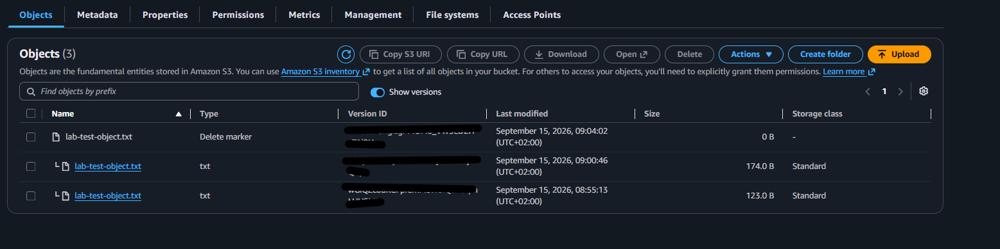

# Secure Amazon S3 Storage

## Objective

Create a private Amazon S3 bucket that protects test data against public
exposure, unencrypted transport, accidental overwrites, and deletion.

The bucket's globally unique name is intentionally excluded from this public
repository.

## Security controls

The bucket was configured with:

- S3 Block Public Access enabled
- All four bucket-level public-access-block settings enabled
- ACLs disabled
- Bucket owner enforced
- S3 Versioning enabled
- Default SSE-S3 encryption
- A bucket policy that denies requests made without TLS
- Test-data classification tags

## Access control

ACLs were disabled so that access is controlled through IAM and bucket
policies instead of legacy per-object ACLs.

Block Public Access prevents public permissions from being introduced through
supported bucket policies or ACLs.

An anonymous request to the test object's HTTPS URL returned `AccessDenied`,
confirming that the object was not publicly accessible.

## Encryption at rest

The bucket uses server-side encryption with Amazon S3 managed keys (SSE-S3).

After uploading the test object, its properties confirmed that SSE-S3
encryption had been applied.

SSE-S3 was selected for this stage because it provides encryption at rest
without the additional key-management complexity and cost of a
customer-managed AWS KMS key.

## Encryption in transit

The bucket policy explicitly denies all S3 actions when
`aws:SecureTransport` is `false`.

The sanitized reusable policy is available here:

[Require encrypted S3 transport](../../policies/s3-deny-insecure-transport.json)

The policy contains an explicit `Deny`, so it does not grant public access.
It applies the TLS requirement to every principal.

## Versioning and recovery test

A test object named `lab-test-object.txt` was uploaded as Version 1.

The file was modified and uploaded again using the same object key, creating
Version 2 while retaining Version 1.

The current object was then deleted. Because versioning was enabled, Amazon S3
created a delete marker instead of permanently erasing either stored version.

The delete marker was removed, and the object successfully reappeared with
the Version 2 content.

## Validation results

| Test | Expected result | Actual result |
|---|---|---|
| Anonymous object request | Access denied | `AccessDenied` |
| Object encryption | SSE-S3 | SSE-S3 confirmed |
| Upload matching object key | Previous version retained | Two versions retained |
| Delete current object | Delete marker created | Delete marker created |
| Remove delete marker | Current object restored | Version 2 restored |
| Non-TLS policy | Explicit deny configured | Policy saved successfully |

## Evidence

The screenshot shows two retained object versions and a delete marker.
The bucket name and Version IDs were removed before publication.

## Troubleshooting note

The first attempt to save the TLS-enforcement policy returned:

`Policy has invalid resource`

The JSON structure was valid, but the resource ARN did not exactly match the
bucket. I corrected the policy by copying the bucket ARN from its Properties
page and using the exact ARN for both the bucket and object resources.

## Future improvements

Future stages can add:

- A customer-managed AWS KMS key and restrictive key policy
- S3 access through a VPC gateway endpoint
- Least-privilege application access through an IAM role
- CloudTrail data-event logging for object-level activity
- Lifecycle rules for managing retained object versions
